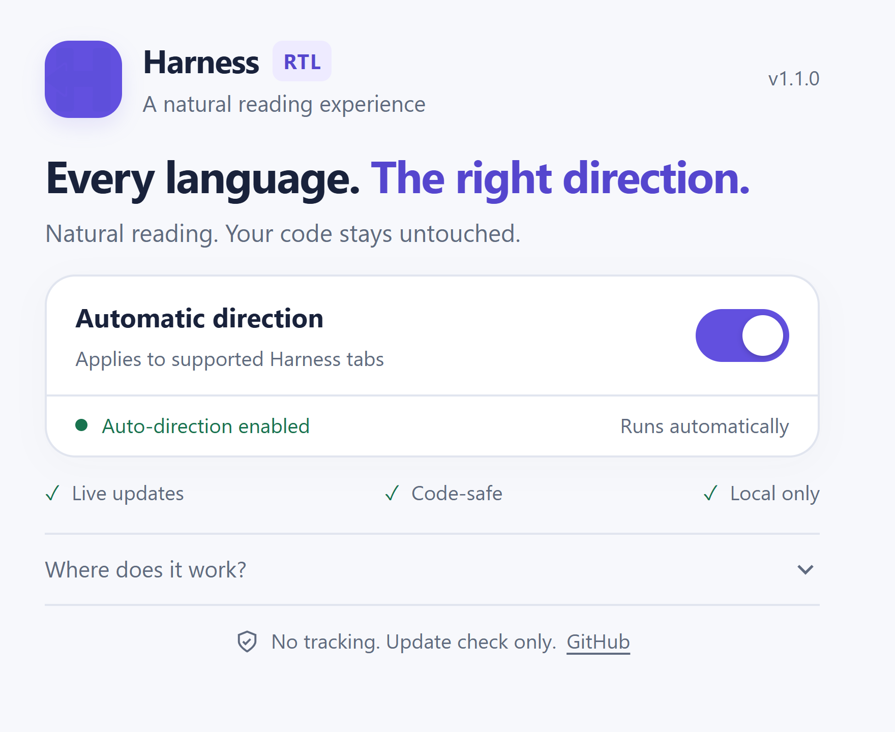
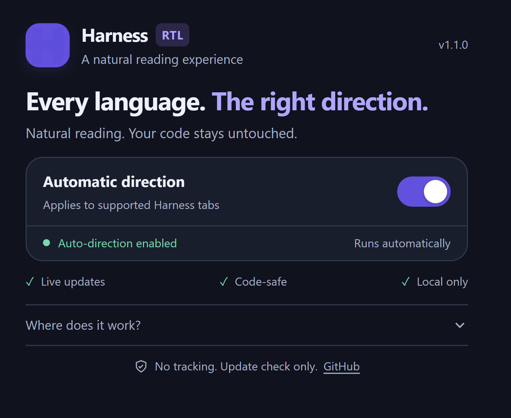

# DeepSeek Harness RTL

**Automatic text direction for a more natural reading experience in DeepSeek Harness.**

**English** · [فارسی](README.fa.md)

A lightweight Chrome extension that makes Persian, Arabic, and Hebrew text read right-to-left while keeping English and code left-to-right. Runs locally, with no build step and no runtime dependencies.

## Features

- Automatic direction detection for text blocks, including new and streaming messages.
- Live direction updates in textareas and editable text fields.
- Left-to-right code blocks and table column order; text inside table cells can use its own direction.
- An English popup with system-aware light/dark themes and a stable 440 × 360 layout.
- A persistent on/off switch shared across supported tabs.
- A minimal update notice: at most once every 24 hours, the popup checks the latest GitHub release and shows a small banner when a newer version exists. Dismissible per version.
- No analytics, external fonts, or tracking of any kind.

This extension adjusts text direction, not the overall app layout. It is an independent project, not an official DeepSeek Harness extension.

## Popup preview

| Light | Dark |
| --- | --- |
|  |  |

## Installation

1. Download this repository using **Code → Download ZIP**, then extract it (or clone the repository).
2. Open `chrome://extensions` in Chrome.
3. Enable **Developer mode**.
4. Click **Load unpacked**.
5. Select the **DeepSeek Harness RTL - Chrome Extension** subfolder containing `manifest.json` — not the repository root.
6. Refresh your DeepSeek Harness tab once.

Direction detection is automatic after installation. Pin the extension to the toolbar to access its switch easily.

### Browser support

The extension uses Manifest V3 and is tested on **Google Chrome**. It also works, with the same **Load unpacked** steps, on any Chromium-based browser:

- Microsoft Edge (`edge://extensions`), Brave (`brave://extensions`), Opera, Vivaldi, and Arc.

**Firefox 109 or newer** is also supported. The extension code only uses APIs that Firefox implements (storage and the `chrome.*` namespace), so the same folder loads unchanged as a temporary add-on:

1. Open `about:debugging#/runtime/this-firefox`.
2. Click **Load Temporary Add-on**.
3. Select the `manifest.json` file inside **DeepSeek Harness RTL - Chrome Extension**.

Firefox removes temporary add-ons when the browser is closed, so repeat these steps after restarting. A permanent Firefox installation requires publishing a signed build on [addons.mozilla.org](https://addons.mozilla.org); the repository includes `manifest.firefox.json` (with the required `browser_specific_settings.gecko` block) for packaging such a build. Safari is not supported; converting the extension would require Apple's `safari-web-extension-converter` on macOS.

### Supported pages

- http://127.0.0.1:3080
- http://localhost:3080

The page title must contain **DeepSeek Harness**. HTTPS, custom hostnames, and other ports are not supported by default. Chrome's content-script match patterns cover local HTTP hosts; the script checks the port and title before making changes.

### Updating

Replace the extension files, click **Reload** on its card at `chrome://extensions`, then refresh your Harness tabs. Keep the extension folder in a permanent location.

## How direction detection works

Each eligible text block is checked for Arabic-script or Hebrew letters. If any are present, the block uses RTL; otherwise it uses LTR. Persian is covered by Arabic-script detection. Code and URLs are excluded from language detection where supported by the parser.

The extension changes presentation only: it does not rewrite message text or input values. Turning it off removes its direction overrides.

### Limitations

- Mixed-language blocks use RTL whenever qualifying RTL letters are present, even if most words are English.
- Raw paths and complex mixed-direction text can still look ambiguous. Format paths as inline code when possible.
- Composer direction applies to the whole editable field, not separately to each line.
- Future Harness markup changes may require selector updates.
- The popup's theme follows the system; there is no manual theme or font selector.

## Privacy and permissions

The only declared API permission is **storage**, used to save the enabled preference locally. The content script reads page text to determine direction but does not store or transmit conversation content. When the popup is opened, it may make one request to `api.github.com` to fetch the latest release version (at most once per 24 hours); no page content, identifiers, or usage data are sent. Development tools may download test dependencies or a browser; these are not part of the installed extension.

## Repository structure

~~~text
DeepSeek Harness RTL - Chrome Extension/
  manifest.json / manifest.firefox.json
  content.js / content.css
  popup.html / popup.js / popup.css
  icons/
tests/
  rtl.test.mjs
  popup.test.mjs
  update.test.mjs
  popup.visual.mjs
README.md
README.fa.md
~~~

## Development and tests

No build is required for the extension. Node.js 22 is recommended for tests.

~~~sh
cd tests
npm ci
npm test
~~~

These tests cover direction detection, streaming updates, typing, disabling/restoring styles, popup settings, and storage failure recovery.

### Browser layout tests

~~~sh
cd tests
npx playwright install chromium
npm run test:visual
~~~

To use an already installed Chrome instead of downloading Chromium (PowerShell):

~~~powershell
$env:BROWSER_PATH = 'C:/Program Files/Google/Chrome/Application/chrome.exe'
npm run test:visual
~~~

The layout test renders the popup files with mocked Chrome APIs. It checks light/dark themes and stable dimensions across loading, enabled, paused, and expanded-help states. Screenshots are written to `tests/screenshots/` and excluded from Git. This does not replace testing an installed extension.

Before releasing, load the unpacked extension and check Persian/Arabic and English messages, streaming output, code blocks, typing, the switch, and repeated popup opening in Chrome.

## Troubleshooting

- **Nothing changes:** confirm the supported URL and title, enable the switch, then refresh the Harness tab.
- **Old popup design:** reload the extension, close the popup, and open it again.
- **Settings error:** use **Try again**, or retry the switch if saving failed.
- **Unexpected text direction:** report the relevant markup and a minimal text example without private conversation data.

## Contributing

Small, focused improvements and reproducible bug reports are welcome. Run the tests before submitting a pull request. Do not include browser profiles, local snapshots, personal paths, or conversation exports.
